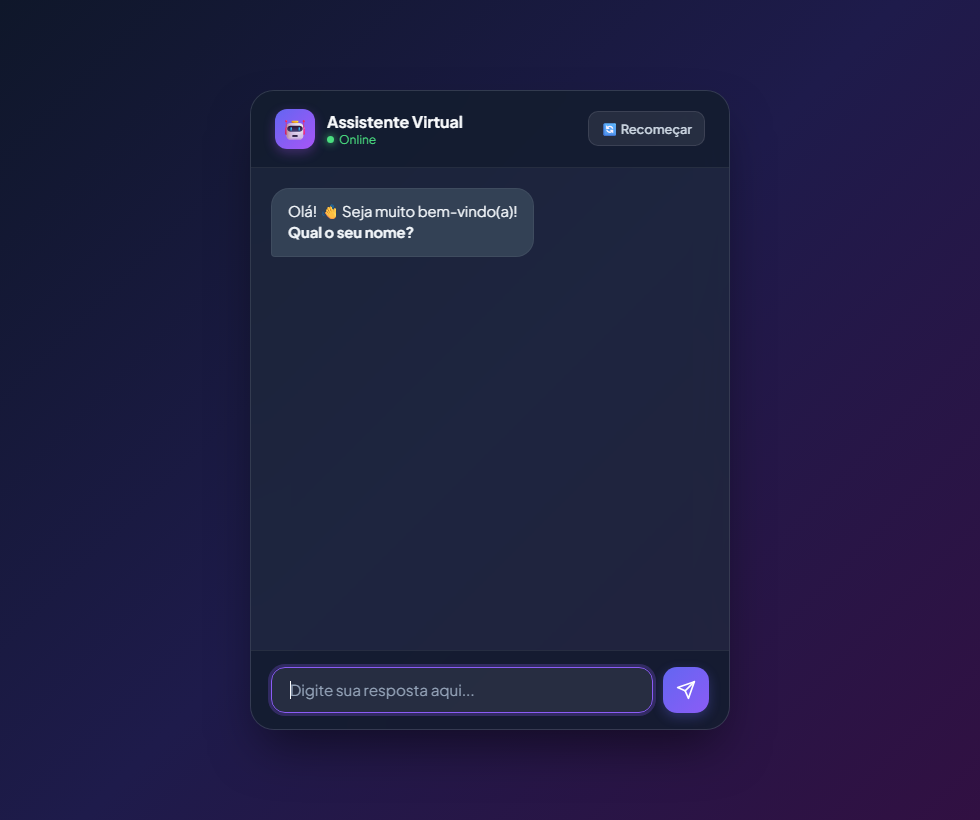

# chat interativo

Um assistente de bate-papo que pergunta seu nome, de onde você é e onde fica a cidade.

Começou no terminal, ganhou uma janela em Python e depois virou essa versão web.

[abrir o chat](https://sabnna.github.io/chat-interativo/)

<p align="center">
  
</p>

## o que ele faz

1. pergunta o seu nome
2. pergunta de onde você é
3. pergunta onde fica essa cidade
4. responde com uma despedida simpática

Dá para recomeçar a conversa a qualquer momento.

## como abrir

### no navegador

Abra o [chat ao vivo](https://sabnna.github.io/chat-interativo/) ou o arquivo `index.html`.

### janela em Python

Precisa do Python 3 (usa só o Tkinter, que já vem junto).

```bash
python chat.py
```

### no terminal

```bash
python versao-terminal.py
```

## arquivos

| arquivo | o que é |
| --- | --- |
| `index.html` | versão web, a mais recente |
| `chat.py` | versão com janela (Tkinter) |
| `versao-terminal.py` | o primeiro rascunho, no terminal |

Feito por [sabnna](https://github.com/sabnna) enquanto aprendia Python.
